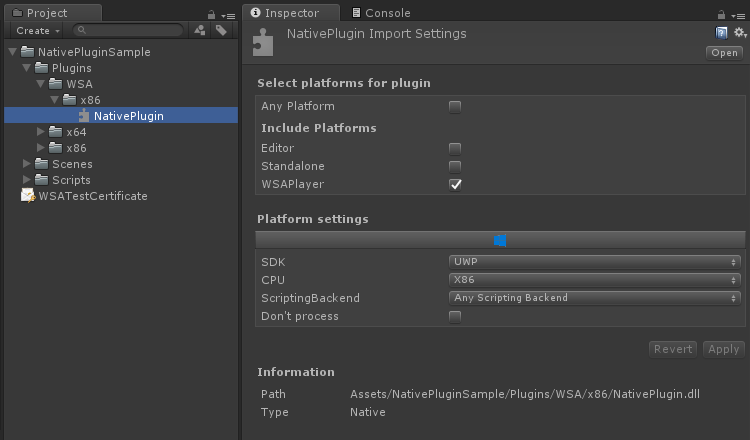
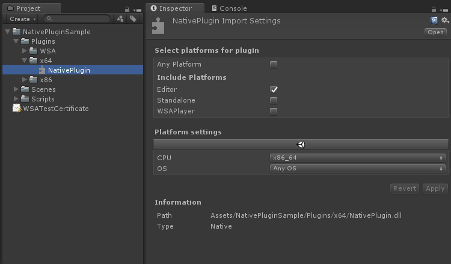
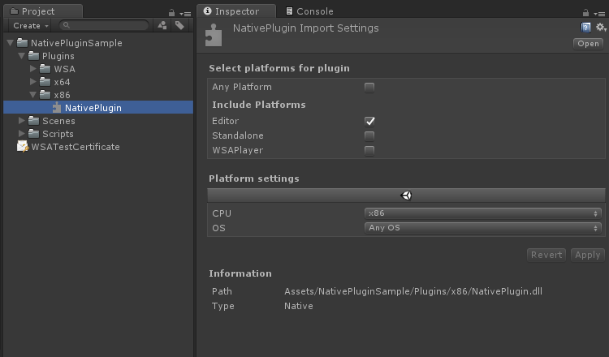

# Unity Project for Native Plugin Sample

## 概要
[NativePluginSampleForHoloLens](https://github.com/sotanmochi/NativePluginSampleForHoloLens)で作成したDLLの動作確認用に作ったUnityのサンプルプロジェクト。

## 開発環境
- Unity 2017.4.2.f2
- Visual Studio 2017
- Microsoft HoloLens

## プラグインの設定
Pluginsのフォルダに各DLLを配置して、インポート設定を変更する。

### HoloLens(UWP)用DLL
「Plugins\WSA\x86」に配置する。設定は以下の通り。

### UnityEditor(64bit)用DLL
「Plugins\x64」に配置する。設定は以下の通り。

### UnityEditor(32bit)用DLL
「Plugins\x86」に配置する。設定は以下の通り。

